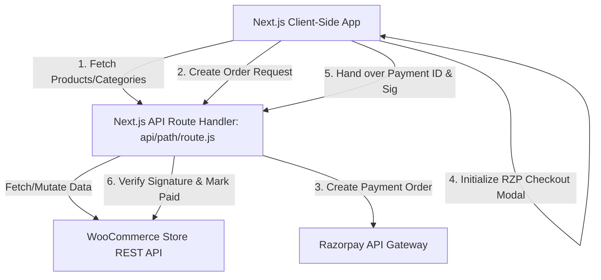

# Codebase & Architecture Analysis

This document provides a comprehensive overview of the design patterns, codebase directory structure, styling guidelines, data flows, and configuration parameters of the **SRIDATTAM** e-commerce application.

---

## 1. Directory Structure

```
SRI_WC-main/
├── .env                  # Local environment configuration (WooCommerce & Razorpay keys)
├── package.json          # Dependency list, package manager details, and scripts
├── tailwind.config.js    # Customized Indic brand palette & animations config
├── postcss.config.js     # PostCSS configurations
├── jsconfig.json         # Module alias paths (e.g. `@/*` maps to `./*`)
├── components.json       # Shadcn UI configuration
├── next.config.js        # Next.js specific build settings
├── backend_test.py       # Python test suite verifying API proxy & input validation
├── test_result.md        # Communication protocol and task verification history log
├── public/               # Static images, assets, and logo vector (logo.svg)
├── app/                  # Next.js 14 App Router routes & endpoints
│   ├── globals.css       # Core Tailwind CSS imports, brand styles, and keyframe animations
│   ├── layout.js         # Root HTML layout (loads Google Fonts, wraps CartProvider)
│   ├── page.js           # Interactive home page featuring Indic aesthetics & incense launch
│   ├── about/            # Brand information and tradition history
│   ├── cart/             # Dedicated shopping cart page
│   ├── checkout/         # Secure checkout page integrated with Razorpay client SDK
│   ├── order-confirmation/ # Post-purchase order details and confirmation page
│   └── products/         # Products catalog directory
│   │   ├── page.js       # Searchable catalog page with category and sort filters
│   │   └── [slug]/       # Dynamic single product page with support for variable attribute selectors
│   └── api/              # Backend directory
│       └── [[...path]]/  
│           └── route.js  # Catch-all proxy routing all client calls to WooCommerce
├── components/           # Reusable UI component blocks
│   ├── layout/           # Shared layout parts (Header, Footer, CartDrawer)
│   ├── products/         # Product-specific components (ProductCard)
│   └── ui/               # Atom-level layout primitives (Sheet, Dialog, Accordion, Badge, Button, Input)
├── hooks/                # Folder for custom React hooks
└── lib/                  # Client and server utility modules
    ├── cart-context.js   # Client cart state wrapper with localStorage synchronization
    ├── wc.js             # Server-side WooCommerce client and safety sanitization
    ├── utils.js          # Helper combining Classnames and Tailwind Merge (`cn`)
    └── products-seed.js  # Seed data script (unused, archived during live API migration)
```

---

## 2. Architectural Components



### A. Frontend Layer (Next.js 14 Client App)
* **Route Structure**: All client pages utilize `'use client'` to facilitate real-time interactions, animations, and cart state synchronization.
* **Layout (`app/layout.js`)**: Configures and injects premium typography from Google Fonts:
  * **Yatra One**: A display font applied to all headings (`h1` through `h5`).
  * **Lora**: A classic serif font used for body copy and general content.
  * **Noto Sans Devanagari**: Tailored for rendering sacred Sanskrit text correctly.
* **Cart State Management (`lib/cart-context.js`)**: Leverages React Context with state synchronization logic.
  * Synchronizes items with `localStorage` (key: `sridattam_cart_v2`).
  * Employs the `storage` event to sync cart updates across multiple active browser tabs.
  * Provides helper operations (`addItem`, `removeItem`, `updateQuantity`, `clearCart`, `openDrawer`, `closeDrawer`).

### B. Backend Proxy Layer (`app/api/[[...path]]/route.js`)
To prevent client-side credential exposure, the frontend does not make calls to the WooCommerce API or Razorpay directly. All requests are routed through a server-side catch-all Route Handler.
* **WooCommerce Client (`lib/wc.js`)**:
  * Employs **Basic Access Authentication** (Consumer Key + Consumer Secret) on the server.
  * Implements `safeProduct`, `safeVariation`, `safeCategory`, and `safeOrder` to strip administrative or sensitive payload data before returning values to the client.
  * Resolves Advanced Custom Fields (ACF) properties such as `feature_image_X` (mapping attachment IDs to real URLs dynamically via the WP Media API).
* **Input Validation**:
  * Slugs are validated against `/^[\p{L}\p{M}\p{N}_-]{1,200}$/u` to permit multi-language Unicode strings.
  * Numeric IDs and Order Keys (`wc_order_[A-Za-z0-9]{6,40}`) undergo strict regex checks.
  * Orders require thorough sanitization of billing data (e.g. 10-digit phone and 6-digit Indian postcodes).
* **CORS & Security Headers**: Injects appropriate safety headers (e.g. `X-Content-Type-Options: nosniff`, `X-Frame-Options: SAMEORIGIN`, `Referrer-Policy: no-referrer-when-downgrade`) across API responses.

### C. Checkout & Payment Flow
1. **Cart Calculation**: Dynamic shipping weight calculations are evaluated on the client and validated on the server. Free delivery triggers when a special weight (`1g` placeholder) is set.
2. **Order Placement**: The client posts to `/api/orders`, which issues a secure order payload to WooCommerce in a `pending` state, retrieving an authoritative WooCommerce Order ID and Order Key.
3. **Payment Processing**:
   * The client initiates a Razorpay Payment Order via `/api/payment/create-rzp-order`.
   * It fetches the WooCommerce order total to guarantee price integrity.
   * If Razorpay credentials are not defined in the environment, the backend falls back to returning the default WooCommerce checkout page URL (`payment_url`).
4. **Payment Verification**:
   * The Razorpay client-side SDK opens the payment modal.
   * On success, verification credentials (`razorpay_payment_id`, `razorpay_signature`) are sent back to `/api/payment/verify`.
   * The backend verifies the HMAC-SHA256 signature using the server-configured `RAZORPAY_KEY_SECRET`.
   * Upon successful verification, the backend makes a `PUT` request to WooCommerce to update the order status to `processing`, marks the invoice as paid, and attaches transaction metadata.

---

## 3. Styling & Aesthetic System

The design utilizes a custom, Indic-themed brand system configured via `tailwind.config.js`:
* **Colors**:
  * **Cream / Ivory (`#FFF3C1`)**: Match the background tone of the primary brand logo.
  * **Saffron (`#FF6B00`)**: Used for primary action buttons, sales tags, and highlights.
  * **Gold (`#D4AF37`)**: Employed for special text highlights, borders, and glowing accents.
  * **Maroon (`#800020`)**: Used for headings, secondary actions, and card highlights.
* **Micro-Animations & Effects**:
  * **Mandala Spin**: Circular, rotation animation applied to background icons.
  * **Flicker**: Simulates a warm flame glow effect on sacred symbols (e.g., the Om `ॐ` mark).
  * **Ember Rise**: Spawns floating glowing particles that rise from the bottom of sections.
  * **Premium 3D Hover Tilt**: Mouse move handlers capture coordinate offsets on premium showcase cards, producing a responsive, glassmorphic glare angle.

---

## 4. Testing Configuration

* **Python Test Suite (`backend_test.py`)**:
  * Validates health check responses.
  * Ensures a `503 Service Unavailable` status with a `WC_NOT_CONFIGURED` code is returned if environment keys are missing.
  * Verifies header validation, invalid parameters, missing/invalid checkout billing info, incorrect email/phone patterns, and incorrect route behavior.
  * Validates CORS headers, security parameters, and checks for potential credential leakage.
* **Verification Log (`test_result.md`)**:
  * Operates under a strict logging format tracking implemented features, priority queues, test iteration results, and issues needing attention.
